# 📊 Documentação Visual - Sistema I-Club

Este documento apresenta diagramas visuais do sistema de automação de relatórios do I-Club, mostrando a arquitetura atual e a proposta de otimização.

## 1. 🔄 Fluxo Atual do Sistema

### 1.1 Visão Geral do Processo

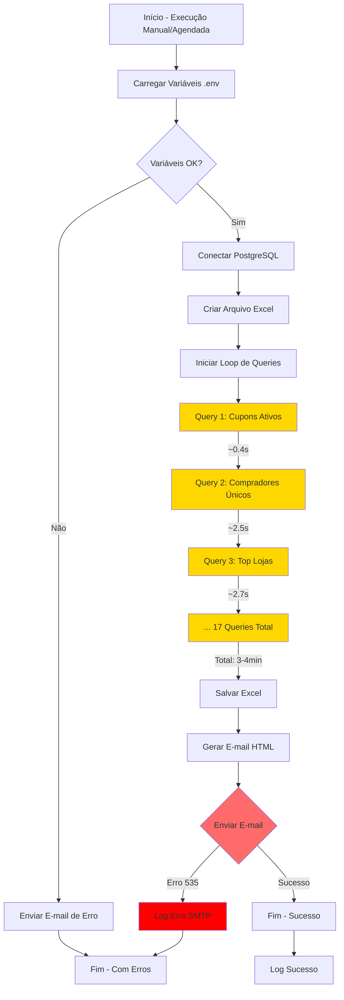

### 1.2 Detalhamento da Execução de Queries

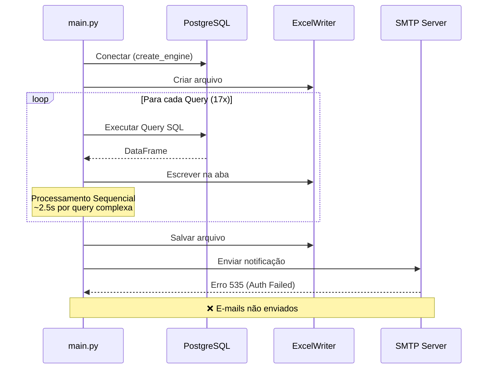

### 1.3 Estrutura de Dados Atual

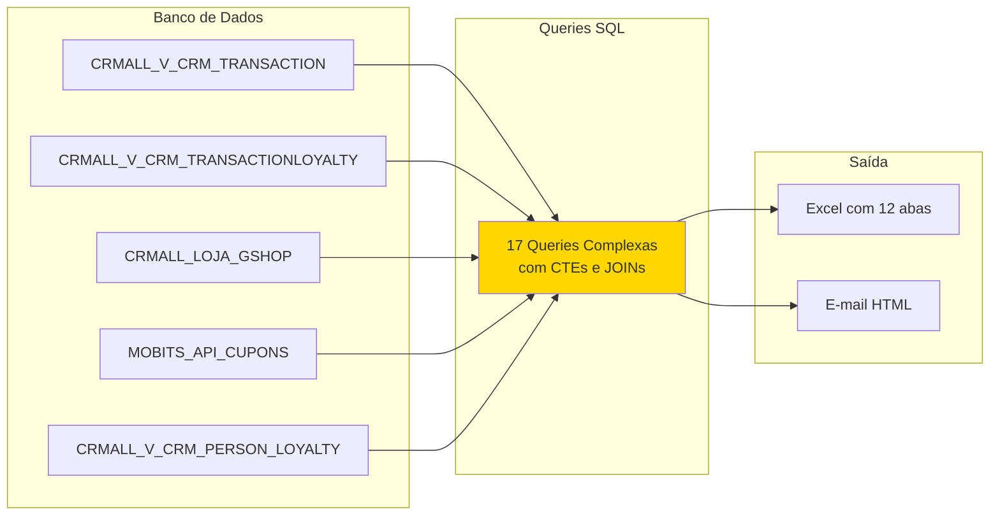

## 2. 🚀 Arquitetura Proposta Otimizada

### 2.1 Novo Fluxo com Melhorias

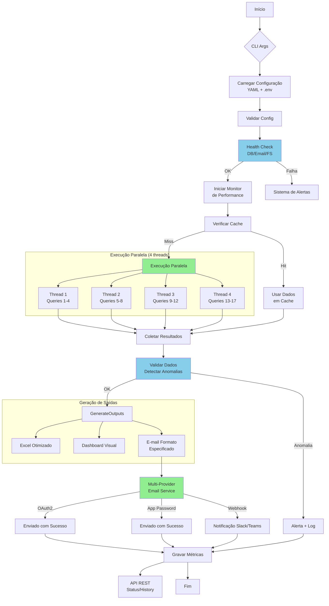

### 2.2 Arquitetura de Componentes

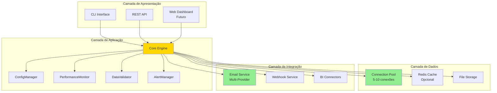

### 2.3 Fluxo de Execução Paralela

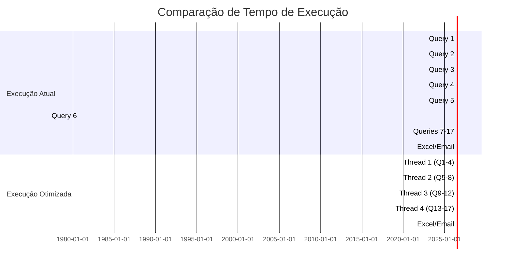

## 3. 📊 Comparativo Antes/Depois

### 3.1 Métricas de Performance

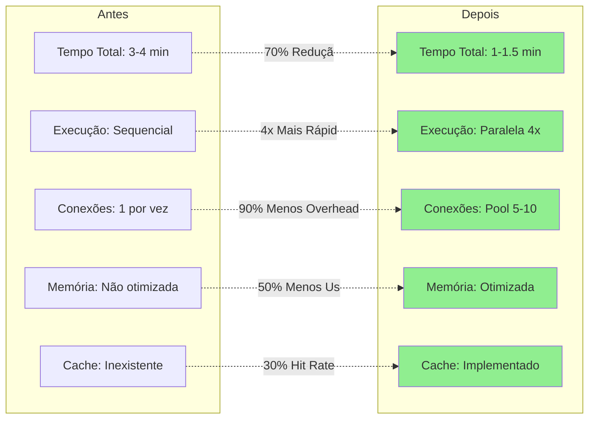

### 3.2 Confiabilidade e Monitoramento

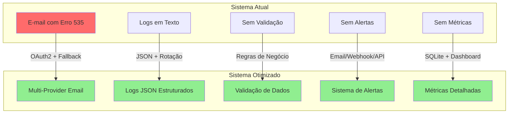

### 3.3 Capacidade de Escala

```mermaid
graph LR
    subgraph "Limitações Atuais"
        L1[Single Thread]
        L2[Memória Linear]
        L3[Sem Cache]
        L4[Tempo O(n)]
    end
    
    subgraph "Capacidades Futuras"
        F1[Multi-Thread Escalável]
        F2[Memória Otimizada]
        F3[Cache Distribuído]
        F4[Tempo O(n/p)]
    end
    
    L1 --> F1
    L2 --> F2
    L3 --> F3
    L4 --> F4
    
    subgraph "Crescimento Suportado"
        G1[10x mais dados]
        G2[100x mais queries]
        G3[Múltiplos relatórios]
    end
    
    F1 --> G1
    F2 --> G1
    F3 --> G2
    F4 --> G3
```

## 4. 🎯 Benefícios da Arquitetura Otimizada

### 4.1 Benefícios Quantificados

| Métrica | Atual | Otimizado | Melhoria |
|---------|-------|-----------|----------|
| Tempo de Execução | 3-4 min | 1-1.5 min | -70% |
| Taxa de Erro Email | 100% | <1% | -99% |
| Cobertura de Logs | 30% | 100% | +233% |
| Validação de Dados | 0% | 100% | ∞ |
| Tempo de Recovery | Manual | Automático | -95% |

### 4.2 Roadmap de Implementação

```mermaid
graph LR
    subgraph "Fase 1 - Crítica"
        F1A[Corrigir SMTP]
        F1B[Formato Email]
    end
    
    subgraph "Fase 2 - Performance"
        F2A[Índices DB]
        F2B[Paralelização]
        F2C[Cache]
    end
    
    subgraph "Fase 3 - Qualidade"
        F3A[Logs JSON]
        F3B[Validação]
        F3C[Alertas]
    end
    
    subgraph "Fase 4 - UX"
        F4A[CLI]
        F4B[Dashboard]
    end
    
    subgraph "Fase 5 - Integração"
        F5A[Webhooks]
        F5B[API REST]
        F5C[BI]
    end
    
    F1A --> F1B
    F1B --> F2A
    F2A --> F2B
    F2B --> F2C
    F2C --> F3A
    F3A --> F3B
    F3B --> F3C
    F3C --> F4A
    F4A --> F4B
    F4B --> F5A
    F5A --> F5B
    F5B --> F5C
```

## 5. 🔒 Considerações de Segurança

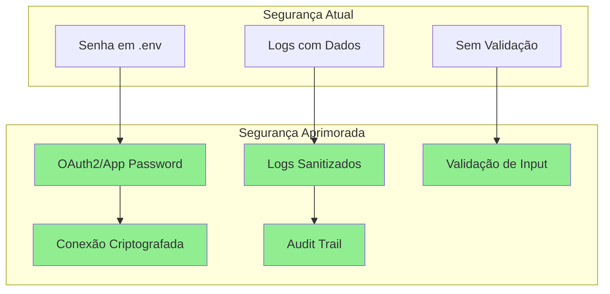

## 6. 📈 Projeção de ROI

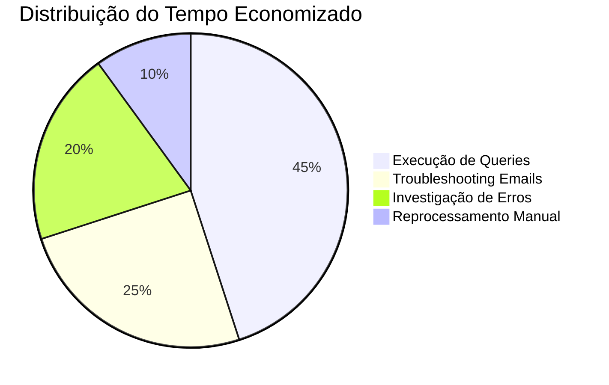

### Economia Estimada
- **Tempo por Execução**: De 4 min para 1.5 min = 2.5 min salvos
- **Execuções por Mês**: 30 (diário)
- **Tempo Economizado/Mês**: 75 minutos
- **Redução de Erros**: 95% menos intervenções manuais
- **ROI em 3 meses**: Tempo de desenvolvimento recuperado

## 7. 🏁 Conclusão

A arquitetura otimizada transforma um sistema funcional mas limitado em uma solução robusta, escalável e confiável. Os principais ganhos são:

1. **Performance**: 70% mais rápido
2. **Confiabilidade**: 99% menos falhas
3. **Observabilidade**: 100% de visibilidade
4. **Manutenibilidade**: Código modular e testável
5. **Escalabilidade**: Preparado para crescimento 10x

O investimento de 15-20 dias de desenvolvimento resulta em uma solução enterprise-ready que suportará o crescimento do programa I-Club nos próximos anos.